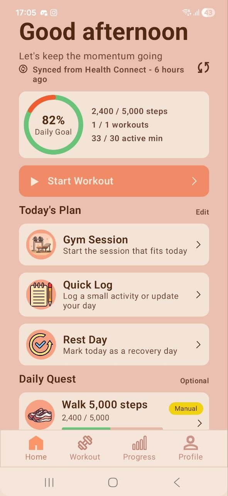
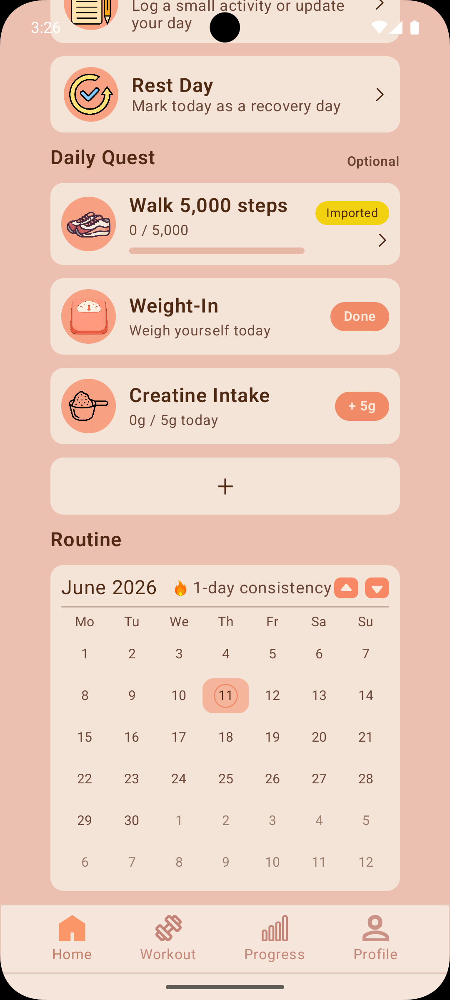
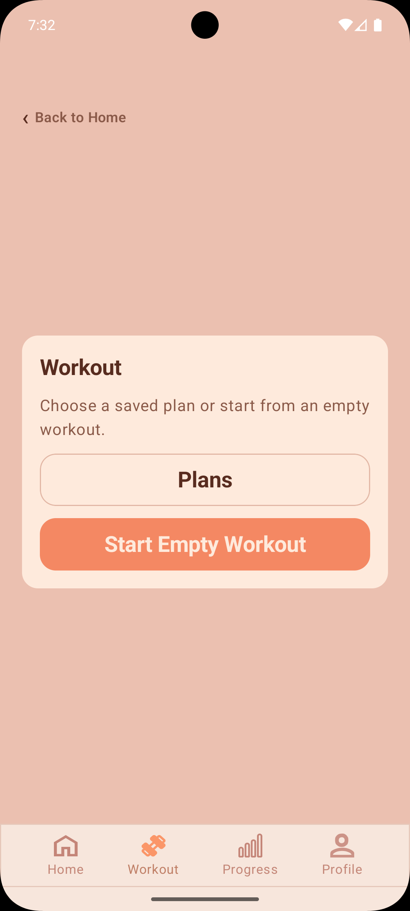
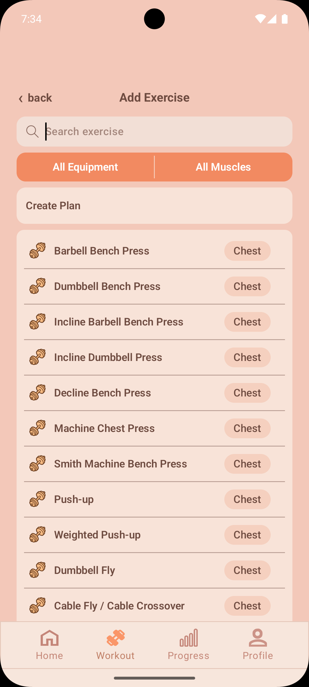
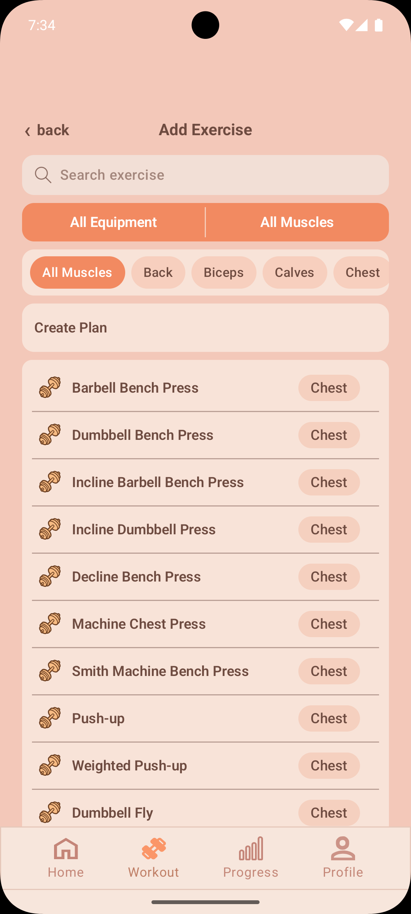
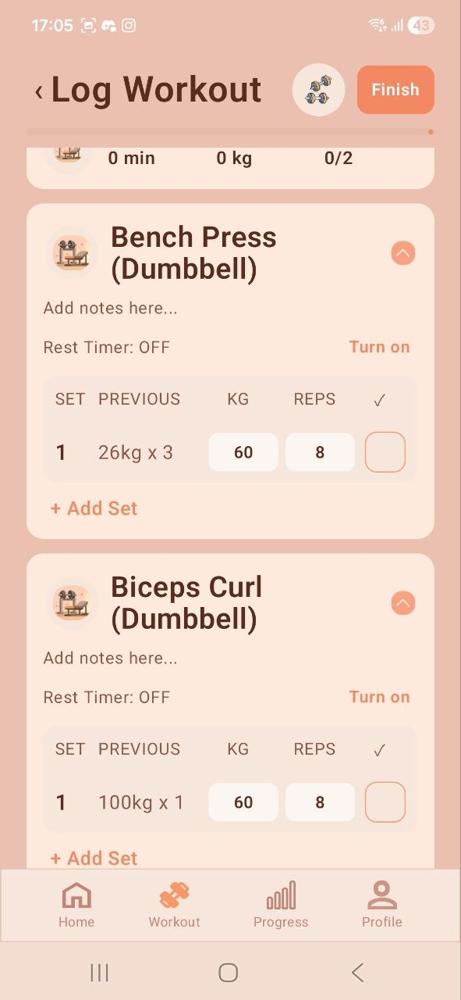
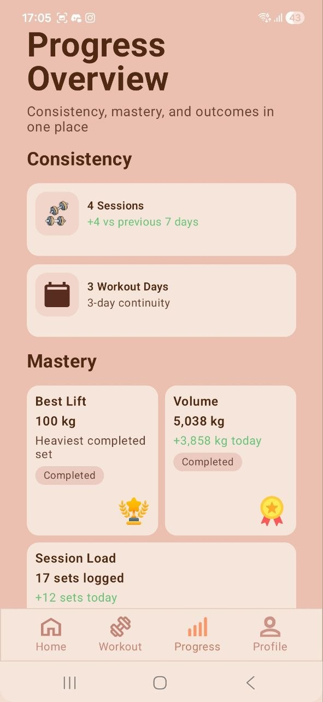
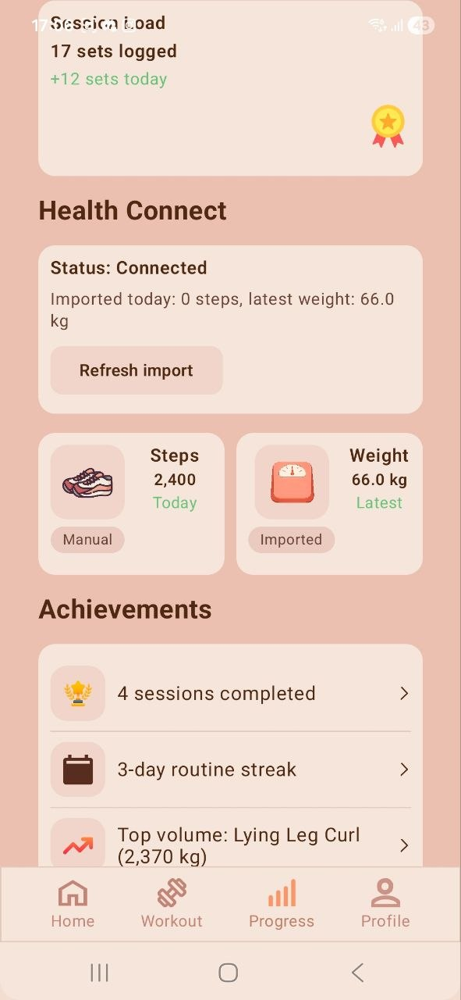
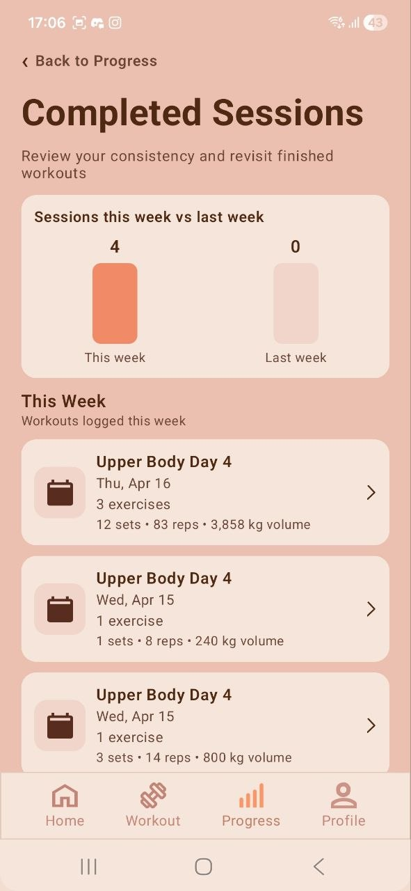
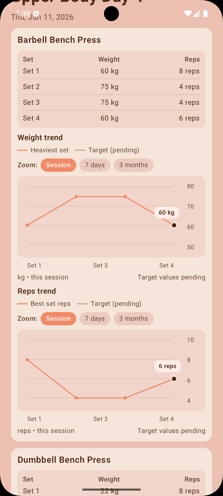

# SDT Fitness App

SDT Fitness App is an Android workout tracker built with Kotlin and Jetpack Compose, with a companion Kotlin/Ktor auth API for email/password sign-in and registration. It focuses on simple daily consistency: start a gym session, log sets, add exercises, track daily steps, review completed workouts, and view progress over time.

## Screenshots

Current prototype screens from the main app flow.

<table>
  <tr>
    <td align="center"><strong>Home</strong></td>
    <td align="center"><strong>Routine</strong></td>
    <td align="center"><strong>Empty workout</strong></td>
  </tr>
  <tr>
    <td></td>
    <td></td>
    <td></td>
  </tr>
  <tr>
    <td align="center"><strong>Add exercise</strong></td>
    <td align="center"><strong>Filtered exercises</strong></td>
    <td align="center"><strong>Log workout</strong></td>
  </tr>
  <tr>
    <td></td>
    <td></td>
    <td></td>
  </tr>
  <tr>
    <td align="center"><strong>Progress</strong></td>
    <td align="center"><strong>Health metrics</strong></td>
    <td align="center"><strong>Completed sessions</strong></td>
  </tr>
  <tr>
    <td></td>
    <td></td>
    <td></td>
  </tr>
  <tr>
    <td align="center"><strong>Session review</strong></td>
    <td></td>
    <td></td>
  </tr>
  <tr>
    <td></td>
    <td></td>
    <td></td>
  </tr>
</table>

## Features

- Home dashboard with daily goal progress, today's plan, daily step quest, routine calendar, quick log, and rest day logging.
- Workout flow with an empty-state prompt, exercise search/filtering, custom exercise sets, and active set logging.
- Active workout tracking with set completion, exercise progress, exercise deletion, and add-exercise support during a session.
- Progress area with completed sessions, best lift, volume, session load, achievements, and completed-session review.
- Optional Health Connect integration for reading steps and weight.
- Local, account-scoped persistence using Room.
- Authentication gate with email/password registration, login, refresh-token restore, saved password credential support, guest mode, and sign out.
- Companion `auth-api` service that implements the Android auth contract for local and deployable backend authentication.

## Tech Stack

- Kotlin
- Jetpack Compose and Material 3
- AndroidX Lifecycle and ViewModel
- Room database with schema exports
- Health Connect client
- Kotlin/Ktor auth API with H2 local storage, Flyway migrations, JWT access tokens, refresh-token rotation, and bcrypt password hashing
- JUnit, AndroidX test, Espresso, and Compose UI testing

## Project Structure

```text
SDTFitnessApp/
+-- app/
|   +-- src/main/java/com/stepandemianenko/sdtfitness/
|   |   +-- auth/          # Auth gate, login/register UI, session repository, secure token storage
|   |   +-- data/          # Room database, repositories, account/session data
|   |   +-- home/          # Home dashboard state and UI models
|   |   +-- progress/      # Progress, session history, and review screens
|   |   +-- quicklog/      # Quick activity logging
|   |   +-- startworkout/  # Workout setup, exercise picker, active workout flow
|   +-- schemas/           # Room schema exports
+-- auth-api/
|   +-- src/main/kotlin/   # Ktor authentication service
|   +-- src/main/resources/db/migration/
|   +-- README.md          # API contract and local HTTPS tunnel workflow
+-- docs/
|   +-- images/readme/     # README screenshots
+-- gradle/
    +-- libs.versions.toml # Version catalog
```

## Getting Started

1. Open the project root in Android Studio.
2. Let Gradle sync install the Android Gradle Plugin, Kotlin, Compose, Room, and Health Connect dependencies.
3. Select the `app` run configuration.
4. Run the app on an emulator or physical Android device.

The app targets SDK 36 and has a minimum SDK of 28.

The app can be used as a local guest without the auth API. To test registration and login, start the local API and expose it through HTTPS, then build the Android app with `SDT_AUTH_BASE_URL`.

In one terminal:

```powershell
.\gradlew.bat :auth-api:run
```

In a second terminal:

```powershell
cloudflared tunnel --url http://localhost:8080
```

Then install the app with the generated HTTPS tunnel URL:

```powershell
.\gradlew.bat :app:installDebug -PSDT_AUTH_BASE_URL=https://your-tunnel-url.trycloudflare.com
```

See `auth-api/README.md` for the full auth API contract, environment variables, curl examples, and Cloudflare Tunnel setup.

## Useful Commands

Run these from the project root:

```powershell
.\gradlew.bat :app:assembleDebug
.\gradlew.bat :app:testDebugUnitTest
.\gradlew.bat :app:connectedDebugAndroidTest
.\gradlew.bat :auth-api:test
.\gradlew.bat :auth-api:run
```

## Health Connect

The app declares Health Connect permissions for reading steps and weight. On a device, Health Connect availability and permission grants determine whether imported health data can be shown or synced into the daily quest/progress surfaces.

## Notes

- Workout and settings data are stored locally with Room.
- The debug build includes account tools for creating test users, switching accounts, and wiping current-account data.
- Authentication links remote users to local Room accounts without deleting guest workout data.
- Refresh tokens are stored through secure local session storage; passwords are never stored in Room.
- Room schemas are exported under `app/schemas` to support migration testing.
