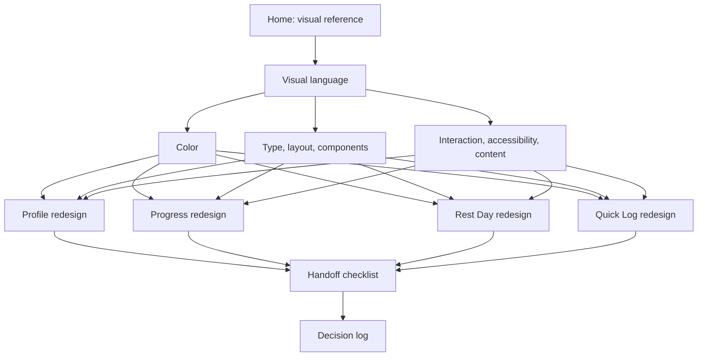

---
aliases:
  - SDT Fitness Design System
  - Design System
tags:
  - sdt-fitness
  - design-system
  - design-hub
status: active
updated: 2026-07-23
---

# SDT Fitness Design System

This is the durable design source of truth for SDT Fitness. It turns the current Home screen's strongest choices into reusable rules and gives future design or implementation work a stable place to start.

The system has two kinds of decisions:

- **Adopted** means preserve it unless a later dated decision explicitly replaces it.
- **Proposed** means use it as the redesign brief, but do not describe it as shipped until implementation and visual QA are complete.
- **Implemented with follow-ups** means the core direction is shipped in code while named resilience or polish work remains.
- **Open** means product or engineering behavior still needs a decision; do not hide the uncertainty in a mock-up.

## How to use this branch

Before designing a screen, read the four foundation notes. Then read the target screen brief and run the handoff checklist. When a design changes a shared rule, update the foundation and add a dated entry to the decision log instead of leaving the decision only in a Figma comment, chat, or source file.

1. Start with [[Foundations - Visual Language]].
2. Apply [[Foundations - Color]].
3. Build with [[Foundations - Type Layout and Components]].
4. Validate behavior with [[Foundations - Interaction Accessibility and Content]].
5. Follow the appropriate screen brief.
6. Finish with [[Workflow - Design Handoff Checklist]].
7. Record changes in [[Decisions - Design Log]].

## Knowledge graph

## Screen briefs

- [[Screen - Profile]] — **proposed redesign**. Make identity, training setup, connections, preferences, and account actions easy to scan without turning the page into another progress dashboard.
- [[Screen - Progress]] — **proposed redesign**. Replace the long inventory of lifetime numbers with a time-bounded progress story and clear drill-downs.
- [[Screen - Home Rest Day]] — **implemented with follow-ups**. Keeps the user in Home context and makes the effect of logging recovery unambiguous.
- [[Screen - Home Quick Log]] — **implemented with follow-ups**. Makes activity, duration, and the final logged result obvious in a fast contextual composer.

## Current reference artifacts

The audit behind these notes used the repository state on 2026-07-23:

- `app/src/main/java/com/stepandemianenko/sdtfitness/Home.kt`
- `app/src/main/java/com/stepandemianenko/sdtfitness/Profile.kt`
- `app/src/main/java/com/stepandemianenko/sdtfitness/Progress.kt`
- `app/src/main/java/com/stepandemianenko/sdtfitness/quicklog/QuickLogScreen.kt`
- `app/src/main/java/com/stepandemianenko/sdtfitness/ui/theme/`
- `app/src/main/res/values/dimens.xml`
- `docs/images/readme/home.jpg`
- `docs/images/readme/progress-overview.jpg`
- `docs/images/readme/progress-health.jpg`

Related project notes: [[app/overview|Login architecture and screen overview]] and [[docs/account-scoped-data|Account-scoped data]].

## Source-of-truth order

When artifacts disagree, resolve them in this order:

1. The latest accepted entry in [[Decisions - Design Log]].
2. Adopted foundation rules in this branch.
3. The relevant screen brief.
4. The latest accepted design file.
5. The current implementation and README screenshots, which may contain legacy or incomplete choices.

This order prevents an old hard-coded color or prototype screenshot from silently becoming a permanent design rule.
